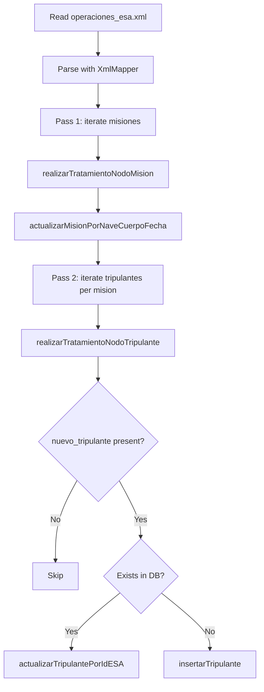

# ProcesadorXMLMision

**Package:** `eu.esa.gemis.procesos`

Reads `operaciones_esa.xml` (a Jackson-compatible XML file), parses it into a `JsonNode` tree using `XmlMapper`, and applies the contents to the database in two ordered passes: missions first, then crew members.

---

## Fields

<ResponseField name="rutaFicheroXML" type="String">
  Absolute or relative path of the XML input file. Loaded on construction from the configuration key `ruta.fichero.xml` via `GestorFicheroConfiguracion.obtenerValor`.
</ResponseField>

---

## Jackson XmlMapper usage

The class uses the Jackson Dataformat XML library to parse the XML file into a generic `JsonNode` tree. This avoids the need for a dedicated JAXB binding class.

```java
ObjectMapper mapeadorXML = new XmlMapper();
JsonNode nodoOperaciones = mapeadorXML.readTree(ficheroXML);
```

Once parsed, child nodes are accessed by name with `JsonNode.get(String fieldName)` and converted to Java types with `.asText()`, `.asInt()`, etc.

<Info>
  Jackson's `XmlMapper` maps XML element names directly to `JsonNode` field names, so `<nombre>Artemis</nombre>` becomes `nodo.get("nombre").asText()`.
</Info>

---

## Methods

### `procesarFicheroXMLMisiones()` (public)

```java
public void procesarFicheroXMLMisiones() throws AgenciaEsaException
```

Entry point for XML processing. Reads the file and executes two sequential passes over the mission list.

<Steps>
  <Step title="Read and parse the XML file">
    Opens the file at `rutaFicheroXML`, passes it to `XmlMapper.readTree()`, and navigates to the mission list:

    ```java
    JsonNode nodoOperaciones = mapeadorXML.readTree(ficheroXML);
    JsonNode listaMisiones = nodoOperaciones.get("misiones").get("mision");
    ```
  </Step>
  <Step title="Pass 1 — process missions">
    Iterates over every `<mision>` node and calls `realizarTratamientoNodoMision(nodoMision)` for each. All missions are updated in the database before any crew data is touched.
  </Step>
  <Step title="Pass 2 — process crew">
    Iterates over the same mission list again. For each mission it navigates to `<tripulacion>` → `<tripulante>` and calls `realizarTratamientoNodoTripulante(nodoTripulante)` for each crew node.
  </Step>
</Steps>

#### Expected XML structure

```xml
<operaciones>
  <misiones>
    <mision>
      <nombre>Artemis VII</nombre>
      <fecha_inicio>2025-06-01</fecha_inicio>
      <fecha_fin_estimada>2025-12-31</fecha_fin_estimada>
      <objetivo>Exploración orbital lunar</objetivo>
      <presupuesto>850000000</presupuesto>
      <estado>ACTIVA</estado>
      <cuerpo_celeste>Luna</cuerpo_celeste>
      <cod_nave>NAV-012</cod_nave>
      <tripulacion>
        <tripulante>
          <ident_esa>42</ident_esa>
        </tripulante>
        <tripulante>
          <ident_esa>99</ident_esa>
          <nuevo_tripulante>
            <nombre>Laura</nombre>
            <apellidos>Fernández Vega</apellidos>
            <nivel_experiencia>3</nivel_experiencia>
            <especialidad>Geóloga</especialidad>
          </nuevo_tripulante>
        </tripulante>
      </tripulacion>
    </mision>
  </misiones>
</operaciones>
```

---

### `realizarTratamientoNodoMision(JsonNode nodoMision)` (private)

```java
private void realizarTratamientoNodoMision(JsonNode nodoMision) throws AgenciaEsaException
```

Builds a `Mision` value object from a `<mision>` XML node and persists it.

#### XML fields read

<AccordionGroup>
  <Accordion title="Mission fields">
    <ResponseField name="nombre" type="String">
      Mission name. Mapped to `Mision.setNombre()`.
    </ResponseField>
    <ResponseField name="fecha_inicio" type="String (ISO date)">
      Start date. Parsed with `LocalDate.parse()` and mapped to `Mision.setFechaInicio()`.
    </ResponseField>
    <ResponseField name="fecha_fin_estimada" type="String (ISO date)">
      Estimated end date. Parsed with `LocalDate.parse()` and mapped to `Mision.setFechaFinEstimado()`.
    </ResponseField>
    <ResponseField name="objetivo" type="String">
      Primary objective. Mapped to `Mision.setObjetivoPrincipal()`.
    </ResponseField>
    <ResponseField name="presupuesto" type="int">
      Assigned budget. Parsed with `Integer.parseInt()` and mapped to `Mision.setPresupuestoAsignado()`.
    </ResponseField>
    <ResponseField name="estado" type="String">
      Mission status. Mapped to `Mision.setEstado()`.
    </ResponseField>
    <ResponseField name="cuerpo_celeste" type="String">
      Celestial body name. Placed into a new `CuerpoCeleste` VO and linked via `Mision.setCuerpoCeleste()`.
    </ResponseField>
    <ResponseField name="cod_nave" type="String">
      Spacecraft code. Placed into a new `Nave` VO and linked via `Mision.setNave()`.
    </ResponseField>
  </Accordion>
</AccordionGroup>

#### Database operation

Instantiates `MisionDaoJDBC` and calls `actualizarMisionPorNaveCuerpoFecha(mision)`. The match criteria used by the DAO are the nave code, celestial body name, and start date.

#### Source

```java
private void realizarTratamientoNodoMision(JsonNode nodoMision) throws AgenciaEsaException {
    Mision mision = new Mision();
    mision.setNombre(nodoMision.get("nombre").asText());
    mision.setFechaInicio(LocalDate.parse(nodoMision.get("fecha_inicio").asText()));
    mision.setFechaFinEstimado(LocalDate.parse(nodoMision.get("fecha_fin_estimada").asText()));
    mision.setObjetivoPrincipal(nodoMision.get("objetivo").asText());
    mision.setPresupuestoAsignado(Integer.parseInt(nodoMision.get("presupuesto").asText()));
    mision.setEstado(nodoMision.get("estado").asText());

    CuerpoCeleste cuerpoCeleste = new CuerpoCeleste();
    cuerpoCeleste.setNombre(nodoMision.get("cuerpo_celeste").asText());
    mision.setCuerpoCeleste(cuerpoCeleste);

    Nave nave = new Nave();
    nave.setCodigo(nodoMision.get("cod_nave").asText());
    mision.setNave(nave);

    IMisionDAO iMisionDAO = new MisionDaoJDBC();
    iMisionDAO.actualizarMisionPorNaveCuerpoFecha(mision);
}
```

---

### `realizarTratamientoNodoTripulante(JsonNode nodoTripulante)` (private)

```java
private void realizarTratamientoNodoTripulante(JsonNode nodoTripulante) throws AgenciaEsaException
```

Inspects a `<tripulante>` XML node and either inserts or updates a crew member in the database.

#### Processing logic

<Steps>
  <Step title="Read ident_esa">
    Reads the `<ident_esa>` element as an integer. This is the ESA identifier used to look up or insert the crew member.

    ```java
    int identificadorESA = nodoTripulante.get("ident_esa").asInt();
    ```
  </Step>
  <Step title="Check for nuevo_tripulante child node">
    Reads the optional `<nuevo_tripulante>` child. If absent, `JsonNode.get()` returns `null`.

    ```java
    JsonNode nodoNuevoTripulante = nodoTripulante.get("nuevo_tripulante");
    ```

    <Note>
      Only `<tripulante>` nodes that contain a `<nuevo_tripulante>` block are processed further. Nodes without it are silently skipped.
    </Note>
  </Step>
  <Step title="Build Tripulante VO">
    When `nodoNuevoTripulante` is not `null`, constructs a `Tripulante` from the child fields:

    | XML element | `Tripulante` setter |
    |-------------|---------------------|
    | `nombre` | `setNombre()` |
    | `apellidos` | `setApellidos()` |
    | *(ident_esa from parent)* | `setIdentificadorEsa()` |
    | `nivel_experiencia` | `setNivelExperiencia()` |
    | `especialidad` | `setEspecialidad()` |
  </Step>
  <Step title="Check database for existing record">
    Calls `TripulanteDaoJDBC.obtenerTripulantePorIdESA(identificadorESA)`. Returns the stored `Tripulante` if found, or `null` if not.
  </Step>
  <Step title="Update or insert">
    - **Crew member exists in DB** → calls `actualizarTripulantePorIdESA(tripulante)` with the new data.
    - **Crew member not in DB** → sets `fechaIngresoEsa` to `LocalDate.now()` and calls `insertarTripulante(tripulante)`.
  </Step>
</Steps>

#### Source

```java
private void realizarTratamientoNodoTripulante(JsonNode nodoTripulante) throws AgenciaEsaException {
    int identificadorESA = nodoTripulante.get("ident_esa").asInt();
    JsonNode nodoNuevoTripulante = nodoTripulante.get("nuevo_tripulante");
    if (nodoNuevoTripulante != null) {
        Tripulante tripulante = new Tripulante();
        tripulante.setNombre(nodoNuevoTripulante.get("nombre").asText());
        tripulante.setApellidos(nodoNuevoTripulante.get("apellidos").asText());
        tripulante.setIdentificadorEsa(identificadorESA);
        tripulante.setNivelExperiencia(nodoNuevoTripulante.get("nivel_experiencia").asInt());
        tripulante.setEspecialidad(nodoNuevoTripulante.get("especialidad").asText());

        ITripulanteDAO iTripulanteDAO = new TripulanteDaoJDBC();
        Tripulante tripulanteBBDD = iTripulanteDAO.obtenerTripulantePorIdESA(identificadorESA);
        if (tripulanteBBDD != null) {
            iTripulanteDAO.actualizarTripulantePorIdESA(tripulante);
        } else {
            tripulante.setFechaIngresoEsa(LocalDate.now());
            iTripulanteDAO.insertarTripulante(tripulante);
        }
    }
}
```

---

## Two-pass processing rationale

Missions are processed before crew to ensure that when a crew member is inserted or updated, the mission record they may be associated with already exists in the database. Attempting crew operations first could result in foreign-key constraint violations.


