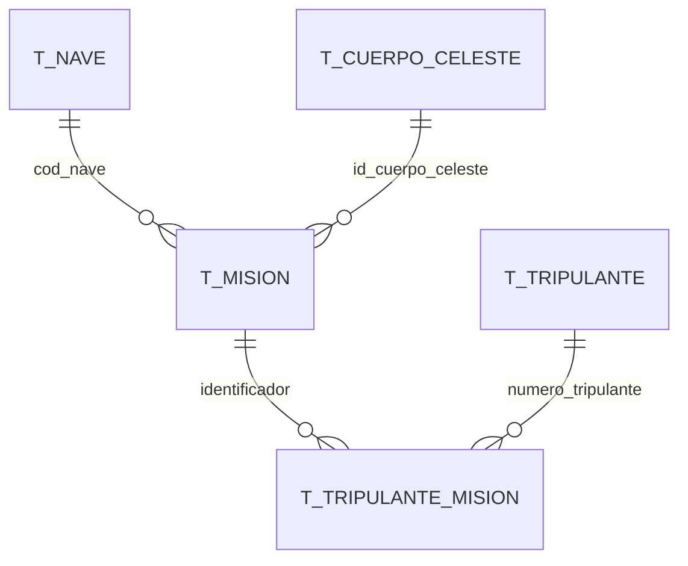

Agencia ESA uses a normalised MySQL schema with five tables. Each table maps directly to a Java value object in the `eu.esa.gemis.vo` package.

## Entity-relationship summary



- A **vessel** (`T_NAVE`) can be assigned to many missions.
- A **celestial body** (`T_CUERPO_CELESTE`) can be the destination of many missions.
- A **mission** (`T_MISION`) can have many crew members, and a **crew member** (`T_TRIPULANTE`) can participate in many missions — the join table `T_TRIPULANTE_MISION` resolves the many-to-many relationship.

<Info>
  All foreign keys use the natural or surrogate primary key of the referenced table. No cascading deletes are assumed; referential integrity is enforced at the database level.
</Info>

## Entities

<AccordionGroup>
  <Accordion title="T_MISION — Mission" icon="rocket" defaultOpen={true}>
    Stores the core mission record, including its assigned vessel, destination, schedule, and financial allocation.

    | Column | SQL type | Java field | Java type | Notes |
    |---|---|---|---|---|
    | `identificador` | `INT` (PK) | `identificador` | `int` | Auto-generated primary key |
    | `nombre` | `VARCHAR` | `nombre` | `String` | Human-readable mission name |
    | `cod_nave` | `VARCHAR` (FK) | `nave` | `Nave` | References `T_NAVE.codigo` |
    | `id_cuerpo_celeste` | `INT` (FK) | `cuerpoCeleste` | `CuerpoCeleste` | References `T_CUERPO_CELESTE.identificador` |
    | `fecha_inicio` | `DATE` | `fechaInicio` | `LocalDate` | Mission start date |
    | `fecha_fin_estimado` | `DATE` | `fechaFinEstimado` | `LocalDate` | Planned end date |
    | `fecha_fin` | `DATE` | `fechaFin` | `LocalDate` | Actual end date; `NULL` if ongoing |
    | `estado` | `VARCHAR` | `estado` | `String` | e.g. `PLANIFICADA`, `EN_CURSO`, `COMPLETADA` |
    | `objetivo_principal` | `TEXT` | `objetivoPrincipal` | `String` | Free-text mission objective |
    | `presupuesto_asignado` | `INT` | `presupuestoAsignado` | `int` | Budget in euros |

    ```java
    // Mision.java — eu.esa.gemis.vo
    public class Mision {
        private int identificador;
        private String nombre;
        private Nave nave;
        private CuerpoCeleste cuerpoCeleste;
        private LocalDate fechaInicio;
        private LocalDate fechaFinEstimado;
        private LocalDate fechaFin;
        private String estado;
        private String objetivoPrincipal;
        private int presupuestoAsignado;
    }
    ```

    <Note>
      The JDBC layer hydrates the `nave` and `cuerpoCeleste` fields by joining `T_NAVE` and `T_CUERPO_CELESTE` in the same query, rather than issuing separate lookups.
    </Note>
  </Accordion>

  <Accordion title="T_NAVE — Vessel" icon="ship">
    Describes the spacecraft available to the agency.

    | Column | SQL type | Java field | Java type | Notes |
    |---|---|---|---|---|
    | `codigo` | `VARCHAR` (PK) | `codigo` | `String` | Alphanumeric vessel code, e.g. `ESA-001` |
    | `nombre` | `VARCHAR` | `nombre` | `String` | Display name |
    | `tipo` | `VARCHAR` | `tipo` | `String` | e.g. `ORBITER`, `LANDER`, `PROBE` |
    | `capacidad_tripulacion` | `INT` | `capacidadTripulacion` | `int` | Maximum crew size |
    | `autonomia_dias` | `SMALLINT` | `autonomiaDias` | `short` | Operational range in days without resupply |

    ```java
    // Nave.java — eu.esa.gemis.vo
    public class Nave {
        private String codigo;
        private String nombre;
        private String tipo;
        private int capacidadTripulacion;
        private short autonomiaDias;
    }
    ```
  </Accordion>

  <Accordion title="T_CUERPO_CELESTE — Celestial body" icon="planet-ringed">
    Catalogue of destination celestial bodies (planets, moons, asteroids, etc.).

    | Column | SQL type | Java field | Java type | Notes |
    |---|---|---|---|---|
    | `identificador` | `INT` (PK) | `identificador` | `int` | Auto-generated primary key |
    | `nombre` | `VARCHAR` | `nombre` | `String` | Display name, e.g. `Marte`, `Europa` |
    | `tipo` | `VARCHAR` | `tipo` | `String` | e.g. `PLANETA`, `LUNA`, `ASTEROIDE` |
    | `gravedad_superficie_ms2` | `DOUBLE` | `gravedadSuperficieMs2` | `double` | Surface gravity in m/s² |

    ```java
    // CuerpoCeleste.java — eu.esa.gemis.vo
    public class CuerpoCeleste {
        private int identificador;
        private String nombre;
        private String tipo;
        private double gravedadSuperficieMs2;
    }
    ```
  </Accordion>

  <Accordion title="T_TRIPULANTE — Crew member" icon="user-astronaut">
    Personnel registry for all ESA crew members.

    | Column | SQL type | Java field | Java type | Notes |
    |---|---|---|---|---|
    | `numero_tripulante` | `INT` (PK) | `numeroTripulante` | `int` | Auto-generated primary key |
    | `nombre` | `VARCHAR` | `nombre` | `String` | First name |
    | `apellidos` | `VARCHAR` | `apellidos` | `String` | Family name(s) |
    | `identificador_esa` | `INT` | `identificadorEsa` | `int` | Internal ESA staff identifier |
    | `nivel_experiencia` | `INT` | `nivelExperiencia` | `int` | Experience level (e.g. 1–5 scale) |
    | `especialidad` | `VARCHAR` | `especialidad` | `String` | e.g. `PILOTO`, `INGENIERO`, `MEDICO` |
    | `fecha_ingreso_esa` | `DATE` | `fechaIngresoEsa` | `LocalDate` | Date the member joined ESA |

    ```java
    // Tripulante.java — eu.esa.gemis.vo
    public class Tripulante {
        private int numeroTripulante;
        private String nombre;
        private String apellidos;
        private int identificadorEsa;
        private int nivelExperiencia;
        private String especialidad;
        private LocalDate fechaIngresoEsa;
    }
    ```
  </Accordion>

  <Accordion title="T_TRIPULANTE_MISION — Crew assignment (join table)" icon="link">
    Resolves the many-to-many relationship between crew members and missions. A crew member can be assigned to multiple missions; a mission can have multiple crew members.

    | Column | SQL type | Java field | Java type | Notes |
    |---|---|---|---|---|
    | `numero_tripulante` | `INT` (PK, FK) | `tripulante` | `Tripulante` | References `T_TRIPULANTE.numero_tripulante` |
    | `identificador_mision` | `INT` (PK, FK) | `mision` | `Mision` | References `T_MISION.identificador` |

    The composite primary key `(numero_tripulante, identificador_mision)` guarantees that the same crew member cannot be recorded twice on the same mission.

    ```java
    // TripulanteMision.java — eu.esa.gemis.vo
    public class TripulanteMision {
        private Tripulante tripulante;
        private Mision mision;
    }
    ```

    <Tip>
      When loading crew for a mission, `TripulanteDaoJDBC` joins `T_TRIPULANTE_MISION` with `T_TRIPULANTE` to return fully hydrated `Tripulante` objects rather than bare identifiers.
    </Tip>
  </Accordion>
</AccordionGroup>

## SQL schema reference

The DDL below summarises the table definitions implied by the application's queries and value objects.

```sql
CREATE TABLE T_NAVE (
    codigo               VARCHAR(20)     NOT NULL,
    nombre               VARCHAR(100)    NOT NULL,
    tipo                 VARCHAR(50)     NOT NULL,
    capacidad_tripulacion INT            NOT NULL,
    autonomia_dias       SMALLINT        NOT NULL,
    PRIMARY KEY (codigo)
);

CREATE TABLE T_CUERPO_CELESTE (
    identificador        INT             NOT NULL AUTO_INCREMENT,
    nombre               VARCHAR(100)    NOT NULL,
    tipo                 VARCHAR(50)     NOT NULL,
    gravedad_superficie_ms2 DOUBLE       NOT NULL,
    PRIMARY KEY (identificador)
);

CREATE TABLE T_MISION (
    identificador        INT             NOT NULL AUTO_INCREMENT,
    nombre               VARCHAR(200)    NOT NULL,
    cod_nave             VARCHAR(20)     NOT NULL,
    id_cuerpo_celeste    INT             NOT NULL,
    fecha_inicio         DATE            NOT NULL,
    fecha_fin_estimado   DATE            NOT NULL,
    fecha_fin            DATE,
    estado               VARCHAR(30)     NOT NULL,
    objetivo_principal   TEXT,
    presupuesto_asignado INT             NOT NULL,
    PRIMARY KEY (identificador),
    FOREIGN KEY (cod_nave)          REFERENCES T_NAVE(codigo),
    FOREIGN KEY (id_cuerpo_celeste) REFERENCES T_CUERPO_CELESTE(identificador)
);

CREATE TABLE T_TRIPULANTE (
    numero_tripulante    INT             NOT NULL AUTO_INCREMENT,
    nombre               VARCHAR(100)    NOT NULL,
    apellidos            VARCHAR(200)    NOT NULL,
    identificador_esa    INT             NOT NULL UNIQUE,
    nivel_experiencia    INT             NOT NULL,
    especialidad         VARCHAR(100)    NOT NULL,
    fecha_ingreso_esa    DATE            NOT NULL,
    PRIMARY KEY (numero_tripulante)
);

CREATE TABLE T_TRIPULANTE_MISION (
    numero_tripulante    INT             NOT NULL,
    identificador_mision INT             NOT NULL,
    PRIMARY KEY (numero_tripulante, identificador_mision),
    FOREIGN KEY (numero_tripulante)    REFERENCES T_TRIPULANTE(numero_tripulante),
    FOREIGN KEY (identificador_mision) REFERENCES T_MISION(identificador)
);
```
