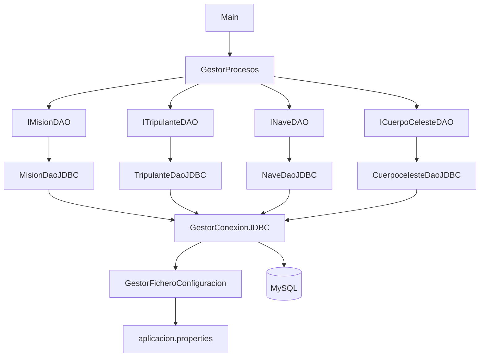

Agencia ESA is structured as a classic layered Java console application. Each layer has a single responsibility and communicates only with the layer immediately below it, keeping business logic isolated from persistence concerns.

## Layer overview

<CardGroup cols={4}>
  <Card title="Entry point" icon="door-open">
    The `Main` class bootstraps the application, creates the top-level `GestorProcesos` instance, and starts the interactive console loop.
  </Card>
  <Card title="Business processors" icon="gears">
    Classes in the `procesos` and `gestor` packages orchestrate use-case logic: they validate inputs, coordinate calls across multiple DAOs, and format output.
  </Card>
  <Card title="DAO layer" icon="database">
    Interfaces in the `dao` package define the persistence contract. Implementations in `dao/impl` translate operations to SQL via JDBC.
  </Card>
  <Card title="MySQL database" icon="server">
    A relational MySQL schema stores all mission, crew, vessel, and celestial-body data. Connection parameters are loaded at startup from a properties file.
  </Card>
</CardGroup>

## Package structure

All classes live under the root package `eu.esa.gemis`.

<CardGroup cols={3}>
  <Card title="eu.esa.gemis" icon="folder">
    Root package. Contains `Main` and top-level configuration helpers.
  </Card>
  <Card title="dao" icon="folder">
    DAO interfaces: `IMisionDAO`, `ITripulanteDAO`, `INaveDAO`, `ICuerpoCelesteDAO`. Each interface defines the CRUD and query contract for one aggregate.
  </Card>
  <Card title="dao/impl" icon="folder">
    JDBC implementations: `MisionDaoJDBC`, `TripulanteDaoJDBC`, `NaveDaoJDBC`, `CuerpocelesteDaoJDBC`. Each class receives a `Connection` and maps `ResultSet` rows to value objects.
  </Card>
  <Card title="excepcion" icon="folder">
    Custom application exceptions thrown across layers, keeping third-party exception types out of higher layers.
  </Card>
  <Card title="gestor" icon="folder">
    `GestorConexionJDBC` and `GestorFicheroConfiguracion` — infrastructure helpers that manage the database connection lifecycle and property file I/O.
  </Card>
  <Card title="procesos" icon="folder">
    `GestorProcesos` and related classes that implement each user-facing menu option, delegating persistence to the DAO layer.
  </Card>
  <Card title="vo" icon="folder">
    Value objects (plain Java beans): `Mision`, `Nave`, `CuerpoCeleste`, `Tripulante`, `TripulanteMision`. No business logic — data carriers only.
  </Card>
</CardGroup>

```
eu.esa.gemis
├── Main.java
├── dao/
│   ├── IMisionDAO.java
│   ├── ITripulanteDAO.java
│   ├── INaveDAO.java
│   └── ICuerpoCelesteDAO.java
├── dao/impl/
│   ├── MisionDaoJDBC.java
│   ├── TripulanteDaoJDBC.java
│   ├── NaveDaoJDBC.java
│   └── CuerpocelesteDaoJDBC.java
├── excepcion/
├── gestor/
│   ├── GestorConexionJDBC.java
│   └── GestorFicheroConfiguracion.java
├── procesos/
│   └── GestorProcesos.java
└── vo/
    ├── Mision.java
    ├── Nave.java
    ├── CuerpoCeleste.java
    ├── Tripulante.java
    └── TripulanteMision.java
```

## DAO pattern

The DAO (Data Access Object) pattern separates the persistence interface from its JDBC implementation. Business processors depend only on the interface, making it straightforward to swap implementations (for example, replacing JDBC with JPA without changing any processor code).

### Interfaces

| Interface | Aggregate |
|---|---|
| `IMisionDAO` | Mission records and their joins to vessels and celestial bodies |
| `ITripulanteDAO` | Crew member records and mission assignments |
| `INaveDAO` | Vessel records |
| `ICuerpoCelesteDAO` | Celestial body records |

### JDBC implementations

Each `*DaoJDBC` class in `dao/impl` follows the same structure:

1. Receives a `java.sql.Connection` via constructor injection.
2. Prepares a `PreparedStatement` for each operation.
3. Executes the statement and iterates the `ResultSet`.
4. Maps each row to the corresponding value object from `vo`.
5. Propagates SQL exceptions as application-level checked exceptions from `excepcion`.

```java
// Example join query from MisionDaoJDBC.java
SELECT tm.nombre as nombre_mision, tm.fecha_inicio,
       tn.codigo as codigo_nave, tn.capacidad_tripulacion,
       tcc.nombre as nombre_cuerpo_celeste, tcc.tipo
FROM T_MISION tm
JOIN T_NAVE tn ON tm.cod_nave = tn.codigo
JOIN T_CUERPO_CELESTE tcc ON tm.id_cuerpo_celeste = tcc.identificador
WHERE year(tm.fecha_inicio) = ?
```

<Note>
  The `?` placeholder is bound by `PreparedStatement.setInt()`, which prevents SQL injection and allows the JDBC driver to reuse the query execution plan.
</Note>

## Connection management

`GestorConexionJDBC` is the single point responsible for obtaining and closing `java.sql.Connection` objects. It delegates configuration lookup to `GestorFicheroConfiguracion`.

<Steps>
  <Step title="Load properties file">
    At startup, `GestorFicheroConfiguracion` reads `aplicacion.properties` from the classpath using `ClassLoader.getResourceAsStream()`. The file contains the JDBC URL, username, and password.

    ```properties
    # aplicacion.properties
    db.url=jdbc:mysql://localhost:3306/agencia_esa
    db.user=esa_user
    db.password=secret
    ```
  </Step>
  <Step title="Build connection">
    `GestorConexionJDBC` calls `DriverManager.getConnection(url, user, password)` using the values returned by `GestorFicheroConfiguracion`. A single `Connection` instance is reused for the lifetime of the application session.
  </Step>
  <Step title="Inject connection into DAOs">
    `GestorProcesos` receives the open `Connection` and passes it to each DAO implementation constructor. All DAO instances share the same connection within a session.
  </Step>
  <Step title="Close on exit">
    When the user exits the console menu, `GestorConexionJDBC` closes the connection, releasing the underlying TCP socket and any server-side resources.
  </Step>
</Steps>

## Full request flow

The following steps trace a typical user interaction — for example, listing missions by year — through every layer.

<Steps>
  <Step title="User input">
    The user selects a menu option and enters a year. `Main` delegates to `GestorProcesos`.
  </Step>
  <Step title="Processor coordination">
    `GestorProcesos` validates the input, then calls `IMisionDAO.findByYear(year)` on the injected DAO instance.
  </Step>
  <Step title="JDBC execution">
    `MisionDaoJDBC` prepares the parameterised SQL query, binds the year parameter, and executes against MySQL.
  </Step>
  <Step title="Result mapping">
    Each row in the `ResultSet` is mapped to a `Mision` value object (with nested `Nave` and `CuerpoCeleste` instances). The list is returned to `GestorProcesos`.
  </Step>
  <Step title="Output">
    `GestorProcesos` formats the list and writes it to `System.out`, completing the interaction.
  </Step>
</Steps>

## Component relationships



<Tip>
  Because `GestorProcesos` depends on DAO interfaces rather than concrete classes, you can introduce an in-memory stub implementation during testing without modifying any processor code.
</Tip>
